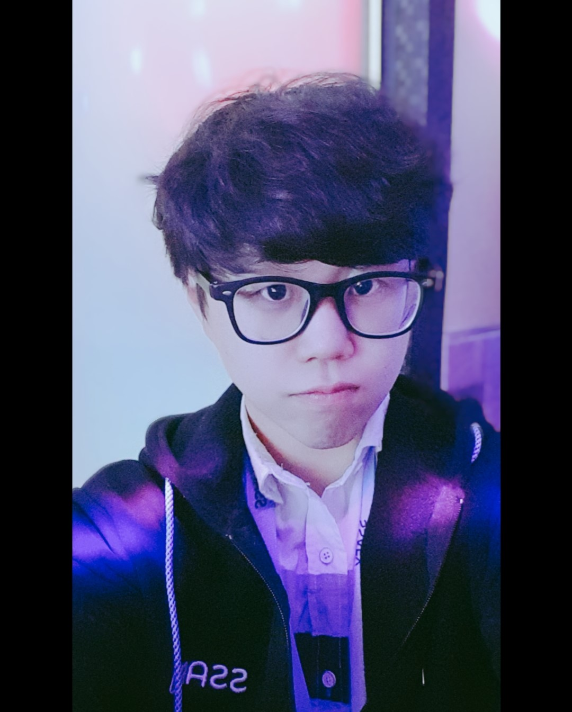

---?ppt_image/shutterstock_481263772.jpg%&position=bottom&color=#b7410e
# 오무라이스의 조장
박상호
---
우직하다. 빠르다. 독특하다.

연말 계획 : 부산 여행!
---?ppt_image/effnacnz_400x400.jpg%&position=bottom&color=#b7410e
# 오무라이스의 큰형
김범현
---
듬직하다. 깊게 본다. 주위를 잘 살핀다.

연말 계획 : 신년을 준비하며 한해를 정리.
---
# 오무라이스의 대변자
박종찬
---
새롭다. 감각적이다. 에너지가 넘친다.
 
연말 계획 : 스테이크 해먹기
---
# 오무라이스의 날개
주효재
---
차분하다. 멀티테스킹에 능하다. 호기심이 많다.

연말 계획 : 신년 계획짜기
---
# 오무라이스의 두뇌
김경태.jpg)
---
예술적이다. 집중력이 뛰어나다. 창의적이다.

연말 계획 : ~~로스트아크~~ 가족과의 시간
---
# 오무라이스의 근육
임현철
---
멀리본다. 직관적이다. 다채롭다.

연말 계획 : ~~동면~~ 한 해를 정리하며 휴식
---
